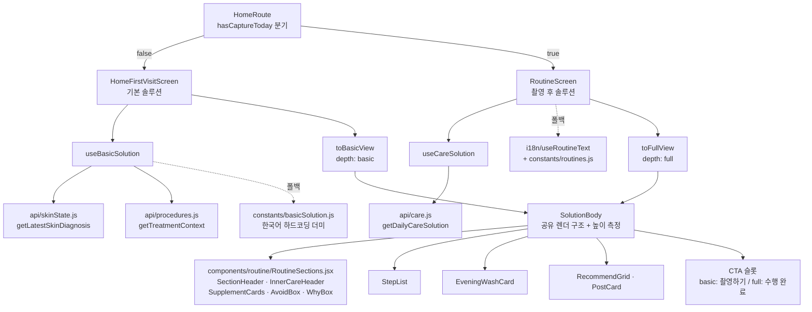
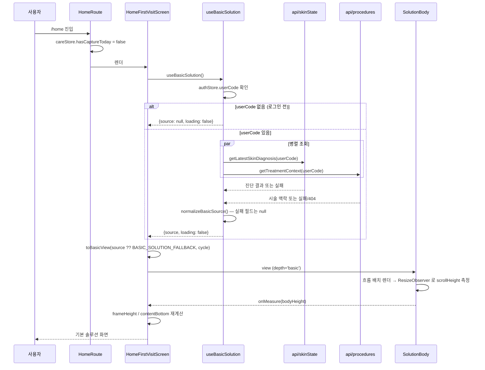
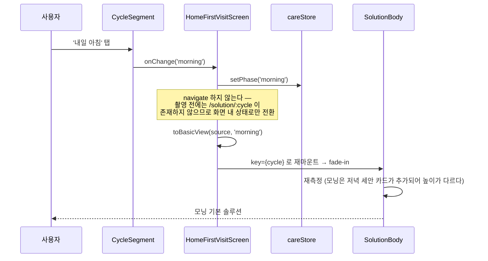

# 설계 문서: 최초 접속 기본 솔루션 (first-visit-basic-solution)

## Overview

최초 접속 홈 화면(`HomeFirstVisitScreen`, Figma `870:3573`)은 지금 "아직 촬영하지 않았다"는 사실만 전달하는 빈 화면이다. 회색 자리표시 카드 3개(`870:3635~3637`)와 값이 `-` 인 사이클 세그먼트 보조 텍스트가 그 상태를 그대로 노출한다. 그런데 서비스 전제상 사용자는 **이미 오프라인에서 정밀 피부 진단을 받고(필요하면 시술까지 받고) 그 기록을 계정에 연결한 뒤** 앱에 들어온다. 즉 촬영 전이라도 솔루션을 만들 근거 데이터는 이미 존재한다. 이 스펙은 그 근거로 **기본 솔루션(basic solution)** 을 구성해 자리표시 UI를 대체한다.

기본 솔루션은 촬영 후 솔루션(`RoutineScreen`, Figma `870:3771` / `870:4002`)과 **항목 구성이 동일**하다. 다른 것은 **깊이(depth)** 뿐이다. 각 항목의 설명이 짧고, 부가 안내 박스(note/footnote)가 빠지고, 추천 카드 수가 줄어든다. 항목 자체를 빼지 않는 이유는 두 가지다. 사용자가 촬영 후에 화면이 갑자기 낯설어지지 않아야 하고, "촬영하면 이 항목들이 더 정밀해진다"는 기대를 화면 구조로 전달해야 한다.

설계의 중심 결정은 **두 화면이 같은 렌더 구조를 공유하고 데이터 깊이만 다르게 주입한다**는 것이다. 항목 파리티(requirement 4)를 문서 규약이 아니라 코드 구조로 보장하기 위해, 본문 렌더링을 `SolutionBody` 로 추출하고 `RoutineScreen` 과 `HomeFirstVisitScreen` 이 각각 정규화된 뷰 모델을 넘긴다.

---

## 조사 결과 (설계 전제)

설계에 직접 영향을 준 코드베이스 조사 결과를 먼저 정리한다. 아래 항목은 모두 실제 파일을 읽어 확인했다.

### 1. 오프라인 정밀 진단의 실제 데이터 출처

`src/api/` 조사 결과, 촬영 없이 쓸 수 있는 근거 데이터 엔드포인트는 두 개다.

| 근거 | API 모듈 | 함수 | 엔드포인트 |
|---|---|---|---|
| 오프라인 정밀 피부 진단 | `api/skinState.js` | `getLatestSkinDiagnosis(userCode)` | `GET /users/{userCode}/skin-diagnosis` |
| 시술 맥락 (종류·시술일·경과일) | `api/procedures.js` | `getTreatmentContext(userCode)` | `GET /users/{userCode}/procedures/treatment-context` |

**중요 구분:** `INNERDERMA_API_SPEC.md` 가 규정하는 스키마(`summary` / `zone_scores` / `aggregate_metrics.priority_concerns`)는 **SkinAge 사진 분석 엔진**의 응답이다. 이건 촬영 이후 경로(`api/skinCapture.js` → `api/skinState.js#analyzeSkin`)에서 쓰이는 것이고, 오프라인 정밀 진단(WHS 전문 장비)의 응답 형태가 아니다. 따라서 **기본 솔루션이 SkinAge 스키마를 그대로 기대하도록 만들면 안 된다.**

다만 두 데이터는 **고민 항목 어휘를 공유**한다. SkinAge 의 `ConcernType` 은 `wrinkle | pore_texture | pigmentation | redness` 이고, 기획서 §8.1 의 AI 사진 분석 5항목은 색소 불균형·모공·주름·홍조·피부결이며 `constants/skinAnalysis.js` 가 이미 `pigmentation | pore | wrinkle | redness | texture` 키로 이를 구현해 두었다. 기본 솔루션의 고민 태그도 **이 키 어휘를 재사용**한다. 그러면 촬영 후 화면과 태그 표기가 일관되고, 나중에 오프라인 진단 응답이 어떤 형태로 확정되든 어댑터 한 곳만 고치면 된다.

`getTreatmentContext` 의 응답 형태는 `api/AGENTS.md` 가 밝히듯 **아직 end-to-end 로 검증되지 않았다**(auth 외 모든 모듈이 스키마 추정 상태). 그래서 정규화 어댑터에서 방어적으로 읽는다.

### 2. `onboardingStore` 는 persist 되지 않는다

`store/onboardingStore.js` 는 순수 `create()` 이고 `persist` 미들웨어가 없다. 즉 **새로고침·재접속하면 `userType` 이 `null` 로 돌아간다.** 게다가 `api/AGENTS.md` 에 따르면 백엔드 `preference` 에는 이 선택을 담을 필드가 없어 서버에서 복구할 수도 없다.

따라서 시술 정보 유무를 `userType === 'DIAGNOSIS_AND_TREATMENT'` 로 판정하면 **재접속한 시술 사용자에게 시술 안내가 사라진다.** 판정 기준은 **API 응답에 시술 맥락이 실제로 있는지**로 두고, `userType` 은 "DIAGNOSIS_ONLY 가 확실할 때 불필요한 요청을 건너뛰는 최적화 힌트"로만 쓴다. (요구사항 5의 "시술 정보가 없는 경우"는 이 판정으로 자연히 커버된다.)

### 3. 흐름(flow) 기반 높이 측정이 필수다

`HomeFirstVisitScreen` 은 현재 모든 블록을 절대좌표(`top: 295 - HEADER_SHRINK`, `top: 390 - HEADER_SHRINK`)로 배치하고 `contentBottom={TAB_BAR_TOP}`(756)을 고정값으로 넘긴다. 내용이 자리표시 3개로 고정이라 문제가 없었다.

기본 솔루션이 들어오면 본문 높이가 텍스트 길이·스텝 수에 따라 변한다. `RoutineScreen` 이 커밋 `9528047` 에서 겪은 문제(절대좌표로 두면 설명이 길어질 때 아래 블록을 밀지 못하고 겹침)가 그대로 재현된다. 그래서 이 화면도 `RoutineScreen` 과 동일한 패턴을 쓴다: 본문을 flex 흐름으로 쌓고, `ResizeObserver` + `document.fonts.ready` 로 `scrollHeight` 를 측정해 `Screen` 의 `height` / `contentBottom` 에 반영한다.

이 측정 로직이 두 화면에 중복되는 것도 `SolutionBody` 추출의 근거다.

### 4. i18n 충돌 지점

현행 방침(`.kiro/steering/i18n-multilingual.md`)은 **새 텍스트는 한국어 하드코딩, `useT()` 등록·사전 추가 금지**다. 그런데 재사용 대상인 `RoutineSections.jsx` 의 컴포넌트들은 이미 번역이 적용되어 **내부에서 `useT()` 를 직접 호출해 고정 라벨을 그린다.**

| 컴포넌트 | 라벨 출처 | 기본 솔루션에서 필요한 것 |
|---|---|---|
| `SectionHeader` | **props** (`label`/`sub`/`title`) | 그대로 사용 가능 |
| `InnerCareHeader` | 내부 `useT()` — `t.solution.innerCare` 등 4개 | 다른 문구 필요 |
| `SupplementCards` | 내부 `useT()` — `t.solution.todayRecommend` | 다른 문구 필요 |
| `AvoidBox` | 내부 `useT()` — `t.solution.avoidToday` | 다른 문구 필요 |
| `WhyBox` | 내부 `useT()` — `t.solution.whyThisRoutine` | 다른 문구 필요 |

**해결책: 옵셔널 라벨 prop + 기존 `useT()` 폴백.** 각 컴포넌트에 라벨 prop 을 추가하되 기본값을 현재의 `useT()` 값으로 둔다.

```jsx
export function AvoidBox({ items, label, title, nodeId }) {
  const t = useT();
  const headLabel = label ?? t.solution.etc;          // 기존 화면: 그대로 'ETC'
  const headTitle = title ?? t.solution.avoidToday;   // 기존 화면: 그대로 번역문
  // ...
}
```

이 방식이 만족하는 조건:
- 사전 파일(`ko/en/zh/ja.js`)을 **건드리지 않는다** → 번역 작업 금지 방침 준수, 4개 언어 파일 구조 파리티 유지
- 기존 `RoutineScreen` 은 prop 을 넘기지 않으므로 **동작·문구가 완전히 그대로다** → 이미 번역된 컴포넌트를 되돌리지 않는다
- 기본 솔루션 화면은 하드코딩 한국어 문자열을 prop 으로 넘긴다 → 새 텍스트는 한국어 하드코딩

즉 기본 솔루션 화면은 다국어 전환 시 한국어로 남고, 이는 "퍼블리싱 후 번역 일괄 진행" 방침에 부합한다. 나중에 번역을 재개할 때는 `constants/basicSolution.js` 의 문자열을 사전 키로 옮기고 prop 전달만 제거하면 된다. **이 마이그레이션 경로를 유지하기 위해 기본 솔루션의 모든 표시 문자열은 JSX 에 흩뿌리지 않고 `constants/basicSolution.js` 한 곳에 모은다.**

### 5. 안전 문구 분리

`constants/routines.js` 의 문구는 사전 검토된 리소스라 임의 변경이 금지되어 있다. 기본 솔루션 문구는 **새 파일 `constants/basicSolution.js`** 에 둔다. `routines.js` 는 읽지도 수정하지도 않는다. 두 파일 사이에 문자열을 공유하지 않는다(파생·요약도 하지 않는다 — 요약 과정에서 검수된 안전 문구의 의미가 훼손될 수 있다).

---

## Architecture



핵심은 `SolutionBody` 가 **단일 렌더 구조**라는 점이다. 항목을 추가·삭제하려면 `SolutionBody` 를 고쳐야 하고, 그러면 두 화면에 동시에 반영된다. 한쪽만 항목이 빠지는 상황이 구조적으로 발생하지 않는다.

### 데이터 흐름 계층

| 계층 | 책임 | 파일 |
|---|---|---|
| API | HTTP 호출만 | `api/skinState.js`, `api/procedures.js` (기존 함수 재사용, 추가 없음) |
| 취득 | 병렬 조회 · 실패 흡수 · 정규화 | `hooks/useBasicSolution.js` (신규) |
| 폴백 데이터 | 한국어 하드코딩 더미 | `constants/basicSolution.js` (신규) |
| 뷰 모델 | 근거 데이터 → 표시 모델, depth 결정 | `lib/solutionView.js` (신규) |
| 렌더 | 항목 구조 · 높이 측정 | `components/routine/SolutionBody.jsx` (신규) |
| 화면 | 헤더·세그먼트·라우팅·CTA 동작 | `HomeFirstVisitScreen.jsx` (수정), `RoutineScreen.jsx` (수정) |

---

## 시퀀스 다이어그램

### 최초 접속 → 기본 솔루션 표시



### 사이클 토글 (오늘 밤 ↔ 내일 아침)



---

## Components and Interfaces

### 신규: `hooks/useBasicSolution.js`

**목적:** 오프라인 진단 + 시술 맥락을 병렬 조회해 정규화된 근거 데이터를 반환한다.

```js
/**
 * @returns {{ source: BasicSolutionSource | null, loading: boolean }}
 */
function useBasicSolution(): { source, loading }
```

**책임:**
- `authStore.userCode` 가 없으면 즉시 `{source: null, loading: false}` (요청하지 않는다)
- 두 요청을 `Promise.allSettled` 로 병렬 실행 — 한쪽 실패가 다른 쪽을 막지 않는다
- `onboardingStore.userType === 'DIAGNOSIS_ONLY'` 면 시술 조회를 **건너뛴다**(최적화). 그 외 값(`DIAGNOSIS_AND_TREATMENT` 또는 `null`)이면 조회한다 — `null` 은 재접속으로 정보가 유실된 상태이므로 조회해야 한다
- 절대 throw 하지 않는다. 에러는 `console.error` 만 남긴다 (`useCareSolution` / `useMarketProducts` 와 동일한 계약)
- 언마운트 후 `setState` 방지를 위한 `cancelled` 플래그 — 기존 훅과 동일 패턴

### 수정: `components/routine/RoutineSections.jsx`

기존 4개 컴포넌트에 **옵셔널 라벨 prop** 을 추가한다. 기본값은 현재의 `useT()` 값이므로 기존 호출부는 무변경이다.

```js
InnerCareHeader({ label, sub, lines, nodeId })      // lines: string[] (기본: [t.solution.intakeSolution1, ...2])
SupplementCards({ cards, recommendLabel, nodeId })
AvoidBox({ items, label, title, nodeId })
WhyBox({ text, tags, label, paddingBottom, nodeId })
```

`SectionHeader` 는 이미 전부 props 라 변경하지 않는다.

**제약:** `SupplementCards` 의 "복용량을 판단하지 않고 제조사 공식 섭취 방법만 노출" 규칙은 기본 솔루션에도 그대로 적용된다. depth 축소가 이 규칙을 우회하는 통로가 되어선 안 된다 — 기본 솔루션의 `howTo` 도 제조사 공식 문구를 그대로 쓰고, 짧게 만들 때 **문장을 잘라내지 않고 더 짧은 공식 문구를 별도로 준비한다.**

### 신규: `components/routine/SolutionBody.jsx`

**목적:** 두 화면이 공유하는 본문 렌더 구조와 높이 측정.

```js
/**
 * @param {SolutionView} view   정규화된 표시 모델
 * @param {'night'|'morning'} cycle
 * @param {(height:number) => void} onMeasure  본문 scrollHeight 변경 알림
 * @param {React.ReactNode} cta  하단 CTA 슬롯 (화면이 주입)
 */
function SolutionBody({ view, cycle, onMeasure, cta })
```

**렌더 순서 (두 depth 동일 — 이것이 항목 파리티의 단일 정의점):**

1. `SectionHeader` — DERMA CARE 블록
2. `StepList` — 스텝 카드 목록
3. `EveningWashCard` — 모닝 사이클 전용
4. `InnerCareHeader` — INNER CARE 블록
5. `SupplementCards` — 섭취 카드
6. `AvoidBox` — 오늘은 피해주세요
7. `WhyBox` — 왜 이 루틴인가요
8. 추천 제목 + `RecommendGrid`
9. `cta` 슬롯

**책임:**
- `ResizeObserver` + `document.fonts.ready` 로 `scrollHeight` 측정 → `onMeasure`
- `key={cycle}` 로 재마운트해 `animate-fade-in` 재생 (기존 `RoutineScreen` 동작 유지)
- `data-node-id` 는 `view.nodeIds` 에서 받아 붙인다. 기본 솔루션은 Figma 원본 노드가 없는 신규 구성이므로 `data-name="BasicSolution*"` 만 두고 `data-node-id` 는 생략한다 — **없는 노드 id 를 발명하지 않는다**(추적성이 거짓이 되면 `scripts/` 픽셀 diff 도구가 잘못된 기준을 잡는다)

### 신규: `lib/solutionView.js`

```js
function toBasicView(source, cycle): SolutionView   // depth: 'basic'
function toFullView(solution, rt, cycle): SolutionView  // depth: 'full'
```

`toFullView` 는 현재 `RoutineScreen` 에 인라인으로 있는 필드별 폴백 로직(`solution?.eveningSteps ?? rt.nightSteps` 등)을 그대로 옮긴 것이다. **동작을 바꾸지 않는다** — 순수 이동이다.

### 수정: `HomeFirstVisitScreen.jsx`

**변경 요약:**

| 항목 | 현재 | 변경 후 |
|---|---|---|
| 회색 자리표시 카드 3개 (`870:3635~3637`) | `openWashCheck` 만 호출 | **제거** → `SolutionBody` 가 대체 |
| `CycleSegment` captions | `{night: '-', morning: '-'}` | `{night: '기본 회복', morning: '기본 보호'}` |
| `CycleSegment` value / onChange | `'night'` 고정, onChange 없음 | `careStore.phase` 바인딩 + `setPhase` |
| `CycleSegment` variant | `'home'` | `'routine'` — 촬영 후와 같은 규격으로 통일 |
| 제목 블록 (`870:3631~3633`) | `t.home.firstVisitTitle` | 유지 (이미 번역됨, 건드리지 않는다) |
| 레이아웃 | 절대좌표 + `contentBottom` 고정 756 | 흐름 배치 + 측정값 기반 `height`/`contentBottom` |
| 헤더 | `SolutionHeader` (height 157) | 유지 |

`CycleSegment` 를 `variant='routine'` 으로 바꾸는 이유: 촬영 전후로 세그먼트 타이포·패딩이 달라지면 같은 홈인데 컨트롤이 미묘하게 튄다. `HEADER_HEIGHT` 를 157 로 통일해 둔 기존 결정(`HEADER_SHRINK` 주석)과 같은 취지다. `HEADER_SHRINK` 상수는 절대좌표를 걷어내면서 함께 제거된다.

### 수정: `RoutineScreen.jsx`

본문 렌더링과 측정을 `SolutionBody` 에 위임하고, 화면은 데이터 취득·헤더·CTA 동작만 남긴다. `noSolution` 분기, 스킨 분석 모달 자동 오픈, `CompleteButton` 동작, `LAYOUT` 실측 상수는 모두 유지한다.

---

## Data Models

### `BasicSolutionSource` — 정규화된 근거 데이터

```js
/**
 * 오프라인 정밀 진단 + 시술 맥락을 화면이 쓰기 좋은 형태로 정규화한 것.
 *
 * 백엔드 연동 대상:
 *   GET /users/{userCode}/skin-diagnosis                  (api/skinState.js#getLatestSkinDiagnosis)
 *   GET /users/{userCode}/procedures/treatment-context     (api/procedures.js#getTreatmentContext)
 *
 * 두 응답 모두 아직 end-to-end 검증 전이므로(api/AGENTS.md) 필드는 전부 옵셔널로 읽는다.
 */
const BasicSolutionSource = {
  /** 진단된 피부 타입 표시명. 예: '복합성 · 수분 부족' */
  skinType: null,          // string | null

  /**
   * 정밀 진단에서 확인된 취약 고민 키.
   * 어휘는 constants/skinAnalysis.js 및 SkinAge ConcernType 과 맞춘다:
   *   'pigmentation' | 'pore' | 'wrinkle' | 'redness' | 'texture'
   * (SkinAge 의 'pore_texture' 는 'pore' 로 접어 넣는다)
   */
  concerns: [],            // ConcernKey[]

  /** 진단 요약 한두 문장. 서버가 문장을 주면 그대로, 없으면 null */
  diagnosisSummary: null,  // string | null

  /** 진단 시점 (YYYY-MM-DD). '왜 이 루틴인가요' 태그에 쓴다 */
  diagnosedAt: null,       // dateKey | null

  /**
   * 시술 맥락. **없으면 null** — 이 null 여부가 시술 안내 표시의 유일한 판정 기준이다.
   * onboardingStore.userType 은 persist 되지 않아 재접속 시 신뢰할 수 없다.
   */
  treatment: null,         // TreatmentContext | null
};

const TreatmentContext = {
  name: null,              // string | null  시술명
  date: null,              // dateKey | null 시술일
  daysSince: null,         // number | null  경과일
  cautions: [],            // string[]       시술 후 주의사항 (서버 제공 문구를 그대로)
};
```

**검증 규칙:**
- `concerns` 는 알려진 키만 통과시킨다. 미지의 키는 조용히 버린다(화면에 원시 코드가 노출되면 안 된다)
- `daysSince` 가 음수거나 숫자가 아니면 `null` 로 접는다
- `cautions` 문구는 **가공하지 않는다** — 시술 주의사항은 안전 문구다
- `diagnosedAt` 형식이 `YYYY-MM-DD` 가 아니면 `null`

### `SolutionView` — 표시 모델

```js
const SolutionView = {
  /** 'basic' | 'full' — 깊이. 렌더 항목 수에는 영향을 주지 않는다 */
  depth: 'basic',

  /** 사이클 세그먼트 보조 텍스트 */
  segmentCaptions: { night: '기본 회복', morning: '기본 보호' },

  /** 1. DERMA CARE 헤더 */
  section: { label: '', sub: '', title: '' },

  /** 2. 스텝 카드. basic/full 모두 4개 — 개수는 depth 와 무관하다 */
  steps: [
    {
      no: '01',
      title: '',
      tag: '',
      tagKey: 'moist',   // StepList TAG_STYLE 의 키. 번역과 무관한 안정 키
      description: '',   // basic: 한 줄 / full: 두 줄
      titleFlex: undefined,  // 없으면 StepList 가 flex-1 기본값으로 처리
    },
  ],

  /** 3. 저녁 세안 카드 (모닝 전용). basic 은 note/footnote 가 null */
  eveningWash: { badge: 'N', title: '', tag: '', description: '', note: null, footnote: null },

  /** 4. INNER CARE 헤더 */
  innerCare: { label: '', sub: '', lines: [''] },

  /** 5. 섭취 카드. basic 도 full 과 같은 장수. note 만 생략 */
  supplements: [{ name: '', howTo: '', note: null }],

  /** 6. 피해주세요 */
  avoid: { label: 'ETC', title: '', items: [] },

  /** 7. 왜 이 루틴인가요 */
  why: { label: '', text: '', tags: [] },

  /** 8. 제품 추천. basic 은 2개(1행), full 은 4개(2행) */
  recommend: { title: '', products: [] },
};
```

---

## depth 규칙 — "분량은 얕게, 항목은 그대로"

요구사항의 핵심 제약을 표로 고정한다. 이 표가 구현·리뷰의 판정 기준이다.

| # | 항목 | full (촬영 후) | basic (촬영 전) | 항목 유지? |
|---|---|---|---|---|
| 1 | DERMA CARE 헤더 | 3줄 (label/sub/title) | 3줄 — 문구만 짧게 | O |
| 2 | 스텝 카드 | 4장, 설명 2줄 (~35자) | **4장**, 설명 1줄 (~20자) | O |
| 3 | 저녁 세안 카드 (모닝) | 설명 + note 박스 + footnote | 설명 1줄, **note·footnote 생략** | O |
| 4 | INNER CARE 헤더 | 2줄 제목 | 1줄 제목 | O |
| 5 | 섭취 카드 | 2장, note 1개 | **2장**, note 생략 | O |
| 6 | 피해주세요 | 3항목, 각 8~12자 | **3항목**, 각 5~8자 | O |
| 7 | 왜 이 루틴인가요 | 3문장 + 태그 3개 | 1~2문장 + 태그 2~3개 | O |
| 8 | 제품 추천 | 4장 (2×2) | 2장 (1×2) | O |
| 9 | 하단 CTA | 수행 완료 버튼 | **오늘 피부 촬영하기 버튼** | O (교체) |

**항목이 줄어드는 곳은 없다.** 줄어드는 것은 각 항목 내부의 글자 수·부가 박스·카드 장수다.

두 가지 판단 근거를 남긴다.

**#7 태그:** full 은 `['오늘 피부 사진', 'WHS 진단 데이터', '시술 후 7일차']` 다. basic 에는 사진 근거가 실제로 없으므로 `'오늘 피부 사진'` 태그를 넣을 수 없다 — 넣으면 근거를 허위 표시하는 것이다. 대신 `['WHS 정밀 진단', '{진단일} 기준']` 을 쓰고, 시술 맥락이 있으면 `'시술 후 N일차'` 를 더해 3개가 된다. 태그는 "근거 출처 목록"이므로 개수 고정이 아니라 실제 근거에 종속되는 것이 맞다.

**#9 CTA:** basic 화면에서 "수행 완료"를 기록할 수 없다. `careStore.completedDates` 는 촬영·분석을 거친 솔루션의 수행 기록이고, 캘린더 초록 칩의 근거다. 기본 솔루션 수행을 여기에 섞으면 캘린더가 "분석 기록이 있는 날"을 잘못 표시한다. 그래서 CTA 를 **촬영 유도**로 교체한다 — 이 화면의 목적 자체가 촬영으로 이어지는 것이기도 하다. 버튼은 기존 `uiStore.openWashCheck()` 를 호출한다(세안 확인 → 카메라 흐름 재사용). 제거된 회색 카드 3개가 갖고 있던 `openWashCheck` 진입점이 이 버튼으로 승계된다.

---

## 알고리즘 의사코드

### 근거 데이터 취득

```pascal
ALGORITHM loadBasicSolutionSource()
INPUT:  userCode from authStore, userType from onboardingStore
OUTPUT: source of type BasicSolutionSource | null

BEGIN
  IF userCode = null THEN
    // 로그인 전 프리뷰. 요청하지 않고 폴백 더미로 간다
    RETURN null
  END IF

  // userType 은 최적화 힌트일 뿐이다. null(재접속으로 유실)이면 조회해야 한다
  needTreatment ← (userType ≠ 'DIAGNOSIS_ONLY')

  tasks ← [ getLatestSkinDiagnosis(userCode) ]
  IF needTreatment THEN
    tasks.append( getTreatmentContext(userCode) )
  END IF

  results ← awaitAllSettled(tasks)   // 한쪽 실패가 다른 쪽을 막지 않는다

  diagnosisRaw ← results[0].fulfilled ? results[0].value : null
  treatmentRaw ← (needTreatment AND results[1].fulfilled) ? results[1].value : null

  IF diagnosisRaw = null AND treatmentRaw = null THEN
    RETURN null        // 화면이 폴백 더미를 쓴다
  END IF

  RETURN normalizeBasicSource(diagnosisRaw, treatmentRaw)
END
```

**Preconditions:**
- `authStore` 가 rehydrate 를 마쳤다 (`client.js` 의 토큰 인터셉터가 동작 가능한 상태)
- 두 API 함수는 `{success,data}` 봉투가 벗겨진 payload 를 반환한다

**Postconditions:**
- 반환값은 `null` 또는 완전히 정규화된 `BasicSolutionSource`. **부분적으로 정규화된 객체를 반환하지 않는다**
- 어떤 경우에도 throw 하지 않는다
- 실패는 `console.error` 로만 기록되고 UI 에 노출되지 않는다

**Loop invariants:** N/A (루프 없음)

---

### 근거 데이터 정규화

```pascal
ALGORITHM normalizeBasicSource(diagnosisRaw, treatmentRaw)
INPUT:  diagnosisRaw, treatmentRaw — 신뢰할 수 없는 서버 payload
OUTPUT: source of type BasicSolutionSource

BEGIN
  source ← emptyBasicSolutionSource()

  IF isObject(diagnosisRaw) THEN
    source.skinType         ← asString(diagnosisRaw.skinType)
    source.diagnosisSummary ← asString(diagnosisRaw.summary)
    source.diagnosedAt      ← asDateKey(diagnosisRaw.diagnosedAt)

    // 알려진 고민 키만 통과. 미지의 코드가 화면에 새는 것을 막는다
    FOR each raw IN asArray(diagnosisRaw.concerns) DO
      ASSERT ∀ k ∈ source.concerns : k ∈ KNOWN_CONCERN_KEYS
      key ← mapConcernKey(raw)        // 'pore_texture' → 'pore' 등
      IF key ≠ null AND key ∉ source.concerns THEN
        source.concerns.append(key)
      END IF
    END FOR
  END IF

  IF isObject(treatmentRaw) AND hasAnyTreatmentField(treatmentRaw) THEN
    source.treatment ← {
      name:      asString(treatmentRaw.procedureName),
      date:      asDateKey(treatmentRaw.procedureDate),
      daysSince: asNonNegativeInt(treatmentRaw.daysSince),
      cautions:  asStringArray(treatmentRaw.cautions)   // 문구 가공 금지
    }
  END IF
  // hasAnyTreatmentField 가 false 면 treatment 는 null 로 남는다 →
  // 시술 없는 사용자와 빈 응답이 같은 경로로 처리된다

  RETURN source
END
```

**Preconditions:** 입력은 임의의 값일 수 있다 (`null`/배열/문자열/부분 객체 모두 허용)

**Postconditions:**
- `source.concerns ⊆ KNOWN_CONCERN_KEYS` 이고 중복이 없다
- `source.treatment` 는 `null` 이거나 4개 필드를 모두 가진 객체다
- `source.treatment.cautions` 의 각 문자열은 입력과 문자 단위로 동일하다
- 입력을 변경하지 않는다 (side-effect free)

**Loop invariants:**
- concerns 루프: 매 반복 시작 시 `source.concerns` 의 모든 원소는 알려진 키이며 중복이 없다

---

### 기본 뷰 모델 조립

```pascal
ALGORITHM toBasicView(source, cycle)
INPUT:  source: BasicSolutionSource | null, cycle ∈ {'night','morning'}
OUTPUT: view of type SolutionView with depth = 'basic'

BEGIN
  // source 가 null 이면 폴백 더미로 전체를 채운다 (화면은 절대 비지 않는다)
  s ← source ?? BASIC_FALLBACK_SOURCE

  night ← (cycle = 'night')
  copy  ← night ? BASIC_NIGHT : BASIC_MORNING    // constants/basicSolution.js

  view.depth           ← 'basic'
  view.segmentCaptions ← BASIC_SEGMENT_CAPTIONS
  view.section         ← copy.section
  view.steps           ← copy.steps              // 항상 4장
  view.eveningWash     ← night ? null : copy.eveningWash
  view.innerCare       ← BASIC_INNER_CARE
  view.supplements     ← BASIC_SUPPLEMENTS       // 항상 2장, note 없음
  view.avoid           ← copy.avoid              // 항상 3항목

  // ── '왜 이 루틴인가요' 는 실제 근거만 반영한다 ──
  view.why.label ← BASIC_WHY_LABEL
  view.why.text  ← s.diagnosisSummary ?? buildSummaryFrom(s.skinType, s.concerns)
                                       ?? BASIC_WHY_FALLBACK_TEXT

  tags ← [ '오프라인 정밀 진단' ]
  IF s.diagnosedAt ≠ null THEN
    tags.append( formatDiagnosedTag(s.diagnosedAt) )      // 예: '8월 12일 진단 기준'
  END IF
  IF s.treatment ≠ null THEN
    IF s.treatment.daysSince ≠ null THEN
      tags.append( '시술 후 ' + s.treatment.daysSince + '일차' )
    ELSE IF s.treatment.name ≠ null THEN
      tags.append( s.treatment.name )
    END IF
  END IF
  view.why.tags ← tags                                    // 2~3개

  // ── 시술 주의사항은 '피해주세요' 에 덧붙인다 (§14: 기본 케어에 조건을 추가) ──
  IF s.treatment ≠ null AND s.treatment.cautions ≠ [] THEN
    // 항목 수 상한을 두어 카드가 무한히 자라지 않게 한다.
    // 자르는 것은 '개수'이고 각 '문구'는 원문 그대로 쓴다
    view.avoid.items ← take(s.treatment.cautions, MAX_CAUTION_ITEMS) ⧺ copy.avoid.items
    view.avoid.items ← take(view.avoid.items, BASIC_AVOID_LIMIT)
  END IF

  view.recommend ← { title: BASIC_RECOMMEND_TITLE,
                     products: take(resolveBasicProducts(), BASIC_RECOMMEND_COUNT) }  // 2장

  ASSERT length(view.steps) = length(FULL_STEPS_OF(cycle))   // 항목 파리티
  ASSERT length(view.supplements) = FULL_SUPPLEMENT_COUNT
  ASSERT length(view.avoid.items) ≥ 3

  RETURN view
END
```

**Preconditions:**
- `cycle` 은 `'night'` 또는 `'morning'` 이다 (그 외 값은 호출부에서 `'night'` 로 접는다 — `RoutineScreen` 의 기존 규칙과 동일)
- `constants/basicSolution.js` 의 스텝·섭취·피해주세요 배열은 full 과 같은 개수로 정의되어 있다

**Postconditions:**
- 반환된 `view` 의 모든 필수 필드가 채워져 있다. 렌더 컴포넌트가 `undefined` 를 만나지 않는다
- `view.why.tags` 는 사진 근거 태그를 포함하지 않는다
- 시술 주의사항 문구는 원문 그대로다
- `view.depth = 'basic'` 이며, 항목 개수는 full 과 동일하다

**Loop invariants:** N/A (`take`/`⧺` 는 순수 함수 조합)

---

### 본문 높이 측정과 프레임 높이 반영

```pascal
ALGORITHM measureAndLayout()
INPUT:  bodyRef → DOM element, cycle, view
OUTPUT: frameHeight, contentBottom

BEGIN
  // 마운트 시 & 크기 변할 때마다
  ON mount OR view change OR cycle change DO
    el ← bodyRef.current
    IF el = null THEN RETURN END IF

    measure ← PROCEDURE
      bodyHeight ← el.scrollHeight     // 레이아웃 값 → DeviceFrame 의 scale 에 영향받지 않는다
    END PROCEDURE

    measure()
    observe(el, ResizeObserver → measure)
    onFontsReady(measure)              // 웹폰트 로드 후 줄 수가 바뀔 수 있다
  END ON

  // 아직 못 쟀으면 임시로 프레임 최소 높이를 쓴다 (첫 프레임 깜빡임 방지)
  IF bodyHeight = null THEN
    contentBottom ← FALLBACK_CONTENT_BOTTOM
  ELSE
    contentBottom ← CONTENT_TOP + bodyHeight + CONTENT_TAIL_GAP
  END IF

  frameHeight ← contentBottom + TAB_BAR_BOTTOM_GAP

  ASSERT contentBottom ≥ CONTENT_TOP
  ASSERT frameHeight ≥ contentBottom

  RETURN (frameHeight, contentBottom)
END
```

**Preconditions:**
- 본문이 흐름(flex column) 배치다. 절대좌표 블록이 섞여 있으면 `scrollHeight` 가 실제 내용 높이를 반영하지 못한다
- `PostCard` 처럼 `absolute` 인 자식은 높이를 가진 상대 컨테이너로 감싸져 있다 (기존 `RecommendGrid` 패턴)

**Postconditions:**
- 스크롤 영역이 본문을 자르지 않는다
- 탭바 위에 빈 여백이 남지 않는다
- 텍스트 길이가 2배가 되어도 아래 블록이 겹치지 않고 밀린다

**Loop invariants:** N/A

---

## 예시 사용

```jsx
// pages/HomeFirstVisitScreen.jsx (요지)
export default function HomeFirstVisitScreen() {
  const navigate = useNavigate();
  const t = useT();                                  // 기존 번역 텍스트용 (firstVisitTitle)
  const phase = useCareStore((s) => s.phase);
  const setPhase = useCareStore((s) => s.setPhase);
  const selectedDate = useCareStore((s) => s.selectedDate);
  const openWashCheck = useUiStore((s) => s.openWashCheck);

  const { source } = useBasicSolution();
  const view = useMemo(() => toBasicView(source, phase), [source, phase]);

  const [bodyHeight, setBodyHeight] = useState(null);
  const contentBottom = bodyHeight === null
    ? FALLBACK_CONTENT_BOTTOM
    : CONTENT_TOP + bodyHeight + CONTENT_TAIL_GAP;

  return (
    <Screen
      className="bg-white"
      height={contentBottom + TAB_BAR_BOTTOM_GAP}
      nodeId="870:3573"
      name="최초 접속 홈화면 - 기본 솔루션"
      headerHeight={HEADER_HEIGHT}
      header={<SolutionHeader days={days} selectedDate={selectedDate} height={HEADER_HEIGHT} /* ... */ />}
      tabBarHeight={TAB_BAR_HEIGHT}
      tabBar={<TabBar className="relative h-[96px] w-[393px]" />}
      contentBottom={contentBottom}
    >
      <div className="absolute left-0 w-[393px]" style={{ top: HEADER_HEIGHT }}>
        <CycleSegment
          variant="routine"
          value={phase}
          captions={view.segmentCaptions}   // { night: '기본 회복', morning: '기본 보호' }
          onChange={setPhase}               // navigate 하지 않는다 — 촬영 전이라 /solution 라우트가 없다
        />
      </div>

      <SolutionBody
        view={view}
        cycle={phase}
        onMeasure={setBodyHeight}
        cta={
          <BasicCtaButton
            label="오늘 피부 촬영하기"          // 하드코딩 한국어 (번역 작업 보류 방침)
            onClick={openWashCheck}
          />
        }
      />
    </Screen>
  );
}
```

```jsx
// components/routine/RoutineSections.jsx — 라벨 prop 추가 패턴
export function WhyBox({ text, tags, label, paddingBottom = 32, nodeId }) {
  const t = useT();
  // prop 이 없으면 기존 번역값 → RoutineScreen 은 무변경으로 동작한다
  const heading = label ?? t.solution.whyThisRoutine;
  /* ... 나머지 마크업 동일 ... */
}
```

```js
// constants/basicSolution.js (요지)
/**
 * 최초 접속(촬영 전) 기본 솔루션 문구.
 *
 * 백엔드 연동 시 교체 대상:
 *   GET /users/{userCode}/skin-diagnosis                 → skinType / concerns / summary
 *   GET /users/{userCode}/procedures/treatment-context    → 시술명 / 경과일 / 주의사항
 *
 * constants/routines.js(사전 검수된 촬영 후 솔루션 문구)와 문자열을 공유하지 않는다.
 * 현행 방침(.kiro/steering/i18n-multilingual.md)에 따라 한국어 하드코딩이며 사전 등록하지 않는다.
 * 번역 재개 시 이 파일의 문자열만 사전 키로 옮기면 된다.
 */
export const BASIC_SEGMENT_CAPTIONS = { night: '기본 회복', morning: '기본 보호' };

export const BASIC_NIGHT = {
  section: { label: 'DERMA CARE', sub: '오프라인 진단 기준 기본 관리', title: '오늘 밤 기본 나이트 루틴' },
  steps: [ /* 4장, description 1줄 */ ],
  avoid: { label: 'ETC', title: '기본 관리 중 피해주세요', items: [ /* 3항목 */ ] },
};
```

---

## Correctness Properties

전량 검증(∀)으로 표현한다. 각 속성은 아래 테스트 전략의 대상이다.

### Property 1: 항목 파리티 (P1)

∀ `cycle` ∈ {night, morning}:
`renderedSections(toBasicView(s, cycle))` = `renderedSections(toFullView(f, rt, cycle))`
— 두 depth 의 렌더 섹션 집합이 같다. (`SolutionBody` 단일 구조로 구조적 보장, 테스트로 재확인)

**Validates: Requirements 3.1, 3.7**

### Property 2: 개수 보존 (P2)

∀ `source`, ∀ `cycle`:
`|view.steps| = 4` ∧ `|view.supplements| = 2` ∧ `|view.avoid.items| ≥ 3`
— 근거 데이터가 비어 있어도(폴백 경로) 항목 수가 줄지 않는다.

**Validates: Requirements 3.2, 6.6**

### Property 3: 분량 축소 (P3)

∀ 대응하는 스텝 쌍 (b, f):
`len(b.description) < len(f.description)` ∧ `b.note = null` ∧ `b.footnote = null`
— basic 이 실제로 더 얕다.

**Validates: Requirements 3.3, 3.4, 3.5, 3.6**

### Property 4: 근거 정직성 (P4)

∀ `view` with `depth = 'basic'`:
`'오늘 피부 사진' ∉ view.why.tags`
— 없는 근거를 표시하지 않는다.

**Validates: Requirements 8.1, 8.2**

### Property 5: 시술 유무 무관 안정성 (P5)

∀ `source`:
`toBasicView(source, cycle)` 는 `source.treatment = null` 이든 아니든 모든 필수 필드가 채워진 완전한 view 를 반환한다.
— 진단만 받은 사용자에게도 화면이 온전하다.

**Validates: Requirements 5.4, 5.5**

### Property 6: userType 비의존 (P6)

∀ `source` with `source.treatment ≠ null`:
`toBasicView` 의 출력은 `onboardingStore.userType` 값과 무관하다.
— persist 되지 않는 `userType` 이 새로고침 후 시술 안내를 사라지게 만들지 않는다.

**Validates: Requirements 4.5, 4.6**

### Property 7: 에러 무노출 (P7)

∀ API 실패 조합 (진단 실패 / 시술 실패 / 둘 다 / 세션 없음):
`useBasicSolution` 은 throw 하지 않고 `loading` 이 최종적으로 `false` 가 되며 화면은 폴백 콘텐츠를 렌더한다.
— `useCareSolution` / `useMarketProducts` 와 동일한 계약.

**Validates: Requirements 6.2, 6.4, 6.7**

### Property 8: 문구 무결성 (P8)

∀ `caution` ∈ `source.treatment.cautions` 가 렌더되면:
렌더된 문자열은 서버 원문과 문자 단위로 동일하다 (말줄임·요약·재작성 없음).
— 안전 문구 보존. 개수 제한(`BASIC_AVOID_LIMIT`)은 허용하되 문구 변형은 금지.

**Validates: Requirements 7.1, 7.2, 7.3**

### Property 9: 레이아웃 무붕괴 (P9)

∀ 스텝 설명 길이 L (정상 범위의 3배까지):
`contentBottom ≥ CONTENT_TOP + bodyHeight` 이며 어떤 블록도 다음 블록과 겹치지 않는다.
— 커밋 `9528047` 의 회귀 방지.

**Validates: Requirements 10.2, 10.5**

### Property 10: 기존 화면 무변경 (P10)

`RoutineScreen` 에 라벨 prop 을 넘기지 않을 때:
모든 섹션의 렌더 출력이 이 변경 전과 동일하다 (한국어 기준으로 검증한다. 라벨 prop 미전달 시 기존 `useT()` 폴백이 동작하므로 다른 언어도 구조적으로 안전하며, 언어별 전수 확인은 번역 재개 시점으로 넘긴다).
— 이미 번역된 컴포넌트를 되돌리지 않는다.

**Validates: Requirements 11.1, 11.2, 12.5**

---

## Error Handling

### 시나리오 1: 세션 없음 (`userCode = null`)

**조건:** 로그인 전 또는 `authStore` rehydrate 실패.
**응답:** 요청을 보내지 않는다. `useBasicSolution` 이 즉시 `{source: null, loading: false}` 반환.
**복구:** `constants/basicSolution.js` 폴백 더미로 전체 화면을 채운다. 화면상 "기본 솔루션"으로 정상 보인다.

### 시나리오 2: 진단 조회 실패 (404 / 네트워크 / 5xx)

**조건:** 오프라인 진단 기록이 아직 연결되지 않았거나 백엔드 미연동 환경.
**응답:** `console.error` 만 남기고 `diagnosisRaw = null`.
**복구:** 시술 맥락만 있으면 그것을 반영하고 진단 부분은 폴백. 둘 다 없으면 전체 폴백. **에러 UI 를 띄우지 않는다.**

### 시나리오 3: 시술 조회 실패 또는 404

**조건:** 시술을 받지 않은 사용자(정상 케이스)와 요청 실패(비정상)가 같은 결과를 낸다.
**응답:** `treatment = null`.
**복구:** 시술 관련 태그·주의사항을 생략한 view 를 만든다. **두 경우를 구분해 다른 UI 를 보여주지 않는다** — 사용자에게 "시술 정보를 불러오지 못했다"고 알리는 것은 진단만 받은 사용자에게 혼란이고, 구분할 근거도 없다.

### 시나리오 4: 응답 형태가 예상과 다름

**조건:** 미검증 스키마(`api/AGENTS.md` 경고)라 필드명·타입이 다를 수 있다.
**응답:** `normalizeBasicSource` 가 필드별로 방어적 파싱. 읽히지 않는 필드는 `null`/`[]`.
**복구:** 부분 데이터 + 폴백 혼합으로 렌더. 미지의 concern 코드는 태그에 노출하지 않고 버린다.

### 시나리오 5: 진단 요약 문구가 과도하게 길다

**조건:** 서버가 `summary` 로 긴 문단을 내려준다.
**응답:** `WhyBox` 는 흐름 배치라 높이가 자라고 `SolutionBody` 가 재측정한다. 잘리지 않는다.
**복구:** depth 정책상 basic 은 짧아야 하므로, **문자열을 자르지 않고** 렌더한다(P8 정신). 길이 정책은 서버 문구 품질 문제로 분리해 백엔드에 피드백한다. 프론트에서 말줄임하면 안전 안내가 중간에 끊길 위험이 있다.

### 시나리오 6: 렌더 예외

**조건:** view 조립 버그로 `undefined.map()` 등.
**응답:** `App.jsx` 의 `ErrorBoundary`(라우트 키 기반)가 잡아 "다시 시도" 를 보여준다.
**복구:** `toBasicView` 가 항상 완전한 view 를 반환하는 postcondition 이 1차 방어선. `ErrorBoundary` 는 최후 수단.

---

## Testing Strategy

이 저장소에는 유닛 테스트 러너가 없다(`frontend/AGENTS.md`). 따라서 검증은 **순수 함수 대상 노드 스크립트**와 **Playwright 시각·동작 확인**으로 나눈다.

### 순수 함수 검증

`normalizeBasicSource` / `toBasicView` 는 React 의존이 없는 순수 함수다. 임시 노드 스크립트로 다음을 확인한다 (검증 후 스크립트는 커밋하지 않는다 — git 워크플로 규칙).

| 대상 속성 | 입력 |
|---|---|
| P2, P5 | `source = null` / 진단만 / 시술만 / 둘 다 / 빈 객체 |
| P4 | 모든 조합에서 `why.tags` 검사 |
| P6 | 같은 source 에 `userType` 을 3가지로 바꿔 출력 비교 |
| P8 | `cautions` 원문과 렌더 대상 문자열 동일성 |
| 정규화 방어 | `concerns` 에 미지 코드·`null`·문자열·숫자 혼입 |

### 속성 기반 테스트 접근

PBT 라이브러리가 프로젝트에 없다. 도입하지 않고 **손으로 만든 생성기**로 대체한다 — `BasicSolutionSource` 필드별 값 후보(정상/`null`/타입 오류/빈 배열)를 데카르트 곱으로 돌려 P2·P5·P7 을 전수 확인한다. 필드 수가 적어 조합이 수백 개 수준이므로 전수가 가능하다. 라이브러리 도입은 이 스펙의 범위를 넘고, 사용자 승인이 필요한 의존성 추가다.

### 시각·동작 검증 (Playwright, `frontend/scripts/`)

| 확인 | 방법 |
|---|---|
| P9 레이아웃 | 스텝 설명을 3배로 늘린 더미로 렌더 → 블록 겹침·잘림 확인, `scrollHeight` 와 `contentBottom` 비교 |
| P1 항목 파리티 | 두 화면 스크린샷에서 섹션 헤더 텍스트 목록 추출해 구조 비교 |
| 사이클 토글 | 최초 접속 홈에서 오늘 밤 ↔ 내일 아침 전환 시 저녁 세안 카드 등장/퇴장, 재측정 확인 |
| P10 회귀 | `npm run sync` 로 `RoutineScreen` 나이트·모닝 프레임 픽셀 diff — 기준선 변화 없어야 한다 |
| CTA | 촬영 버튼 → 세안 확인 모달 → 카메라 흐름 |

**검증 범위:** 이번 구현은 **한국어 기준**으로만 검증한다. 언어 전환 시 문구 확인(4개 언어 전수)은 번역 재개 시점으로 이관한다 — 라벨 prop 미전달 시 기존 `useT()` 폴백이 동작하므로 기존 화면의 다국어 렌더는 구조적으로 유지된다.

### 수동 확인

- `npm run build` 통과
- `npm run lint` 통과
- localStorage 를 비운 상태 / `innerderma.care` 에 옛 값이 남은 상태 양쪽에서 최초 접속 홈 진입
- 새로고침 후 시술 안내가 유지되는지 (P6 — `userType` 유실 시나리오의 핵심 확인)
- 위 항목은 모두 **한국어 표시 상태**에서 확인한다. 언어를 바꿔가며 확인하는 절차는 두지 않는다.

---

## 성능 고려사항

- **요청 2개, 병렬.** `Promise.allSettled` 로 묶어 직렬 대기를 만들지 않는다. 최초 접속 홈은 앱의 첫 실질 화면이라 체감 지연에 민감하다.
- **`ResizeObserver` 는 하나만.** `SolutionBody` 내부에 1개. 두 화면이 각자 옵저버를 두던 중복이 제거된다.
- **`toBasicView` 는 `useMemo`.** `(source, cycle)` 의존. 매 렌더마다 배열을 새로 만들면 `SolutionBody` 의 자식들이 불필요하게 리렌더된다.
- **폴백 상수는 모듈 스코프.** `constants/basicSolution.js` 의 배열은 정적이므로 렌더마다 재생성되지 않는다.
- **추천 상품 조회는 기존 경로 재사용.** `findProductByKey` 로 이미 로드된 카탈로그에서 찾는다. basic 은 2장이므로 full 보다 이미지 로드가 가볍다.
- **깜빡임 방지.** `loading` 중에 스켈레톤이나 빈 화면을 넣지 않는다. 폴백 더미를 즉시 렌더하고, 실제 데이터가 도착하면 문구만 교체된다. 최초 접속 화면에서 로딩 상태를 노출하는 것은 "빈 화면을 없애자"는 이 스펙의 목적과 어긋난다.

---

## 보안·안전 고려사항

- **의료적 확정 표현 금지.** 기본 솔루션 문구는 정상 회복·부작용을 단정하지 않는다(기획서 §14). 진단 요약은 서버가 준 문장을 쓰고, 프론트에서 상태를 판단해 문장을 조립하는 경로(`buildSummaryFrom`)는 피부 타입·고민 키를 나열하는 수준으로만 제한한다.
- **복용량 판단 금지.** `SupplementCards` 의 기존 제약을 basic 에도 적용한다. 제조사 공식 섭취 방법 문구만 노출한다.
- **안전 문구 무변형.** 시술 주의사항(`cautions`)은 원문 그대로 렌더한다(P8). 개수 제한만 허용한다.
- **`routines.js` 격리.** 사전 검수된 촬영 후 문구를 읽거나 요약해서 기본 솔루션에 쓰지 않는다.
- **개인 건강 정보 노출 최소화.** 진단·시술 데이터는 화면 렌더에만 쓰고 localStorage 에 저장하지 않는다. `careStore` 의 persist 대상(`partialize`)에 추가하지 않는다 — 새 필드를 넣으면 `version` 을 올리고 `migrate`/`merge` 를 손봐야 하는데(store 규약), 애초에 저장할 필요가 없는 데이터다. 매 진입 시 서버에서 다시 읽는다.
- **네트워크 실패 시 정보 누출 없음.** 에러 메시지를 UI 에 노출하지 않으므로 엔드포인트·스택이 사용자 화면에 새지 않는다.

---

## 의존성

### 신규 파일

| 파일 | 역할 |
|---|---|
| `frontend/src/constants/basicSolution.js` | 기본 솔루션 한국어 하드코딩 문구 + 폴백 더미 |
| `frontend/src/hooks/useBasicSolution.js` | 진단·시술 병렬 조회 및 정규화 |
| `frontend/src/lib/solutionView.js` | `toBasicView` / `toFullView` 뷰 모델 어댑터 |
| `frontend/src/components/routine/SolutionBody.jsx` | 두 depth 공유 본문 렌더 + 높이 측정 |

### 수정 파일

| 파일 | 변경 |
|---|---|
| `frontend/src/pages/HomeFirstVisitScreen.jsx` | 자리표시 UI 제거, 기본 솔루션 렌더, 흐름 배치 전환, 세그먼트 토글 활성화 |
| `frontend/src/pages/RoutineScreen.jsx` | 본문 렌더·측정을 `SolutionBody` 로 위임 (동작 무변경) |
| `frontend/src/components/routine/RoutineSections.jsx` | `InnerCareHeader`/`SupplementCards`/`AvoidBox`/`WhyBox` 에 옵셔널 라벨 prop 추가 (기본값 = 기존 `useT()` 값) |
| `frontend/src/components/routine/StepList.jsx` | 변경 없음 (`titleFlex` 옵셔널 폴백이 이미 있어 기본 솔루션 스텝을 그대로 받는다) |

### 변경하지 않는 파일 (명시적 결정)

- `frontend/src/i18n/ko.js`, `en.js`, `zh.js`, `ja.js` — 번역 작업 보류 방침
- `frontend/src/i18n/useRoutineText.js` — 촬영 후 솔루션 전용, 구조 유지
- `frontend/src/constants/routines.js` — 사전 검수 문구
- `frontend/src/api/*` — 필요한 함수(`getLatestSkinDiagnosis`, `getTreatmentContext`)가 이미 있다. 엔드포인트 추가 없음
- `frontend/src/store/careStore.js` — persist 필드 추가 없음 (버전 올릴 필요 없음)
- `frontend/src/store/onboardingStore.js` — persist 추가는 이 스펙 범위 밖. 대신 `userType` 에 의존하지 않는 설계로 회피한다

### 내부 의존성

`@/api/skinState`, `@/api/procedures`, `@/store/authStore`, `@/store/careStore`, `@/store/uiStore`, `@/store/onboardingStore`(힌트 용도), `@/components/layout/Screen`, `@/components/layout/TabBar`, `@/components/home/SolutionHeader`, `@/components/home/CycleSegment`, `@/components/routine/*`, `@/components/market/PostCard`, `@/constants/marketScreens`(`findProductByKey`), `@/lib/calendar`, `@/i18n`(기존 번역 컴포넌트 경유만)

### 외부 의존성

없음. 새 npm 패키지를 추가하지 않는다.

---

## 열린 질문 (구현 전 확인 권장)

1. **`GET /users/{userCode}/skin-diagnosis` 의 실제 응답 필드명.** `api/AGENTS.md` 가 배포 백엔드의 `/api-docs` 확인을 요구한다. `skinType` / `concerns` / `summary` / `diagnosedAt` 은 이 설계의 추정이다. 필드명이 다르면 `normalizeBasicSource` 한 곳만 수정하면 된다.
2. **`treatment-context` 의 `cautions` 존재 여부.** 없다면 시술 주의사항을 '피해주세요' 에 덧붙이는 경로가 폴백 문구로만 동작한다. 그래도 P5(시술 유무 무관 안정성)는 만족한다.
3. **기본 솔루션 문구의 검수 주체.** `routines.js` 문구가 사전 검수 리소스인 것처럼, 기본 솔루션 문구도 같은 검수를 거쳐야 하는지 확인이 필요하다. 이 설계는 문구를 한 파일(`constants/basicSolution.js`)에 모아 검수 대상을 명확히 하는 것으로 대비한다.
